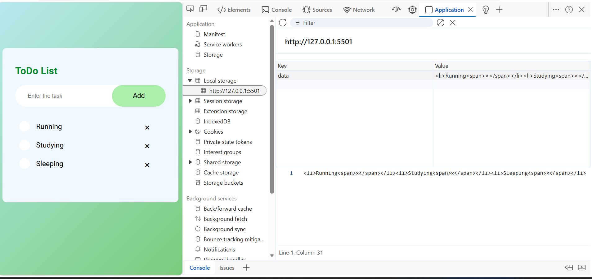
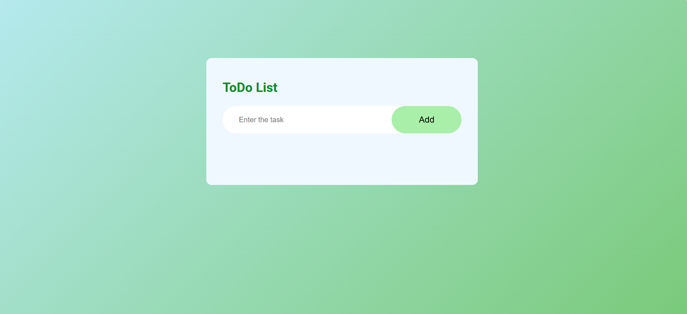
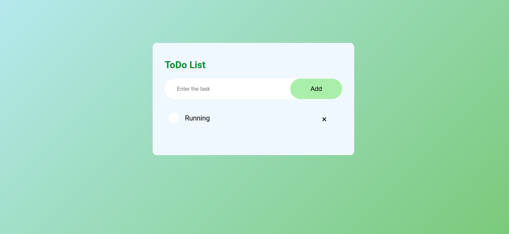
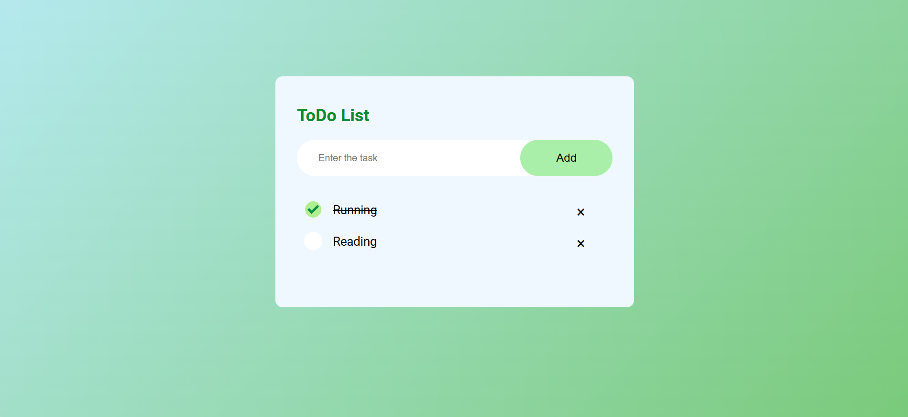
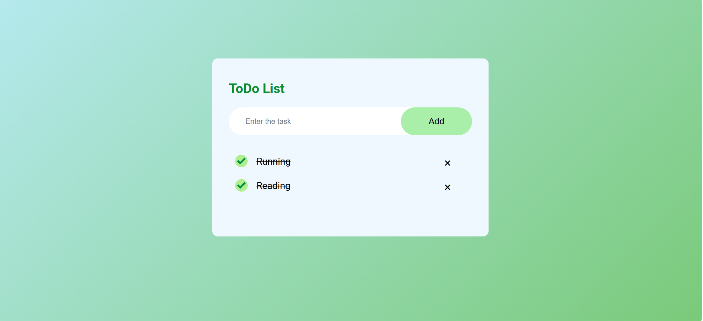
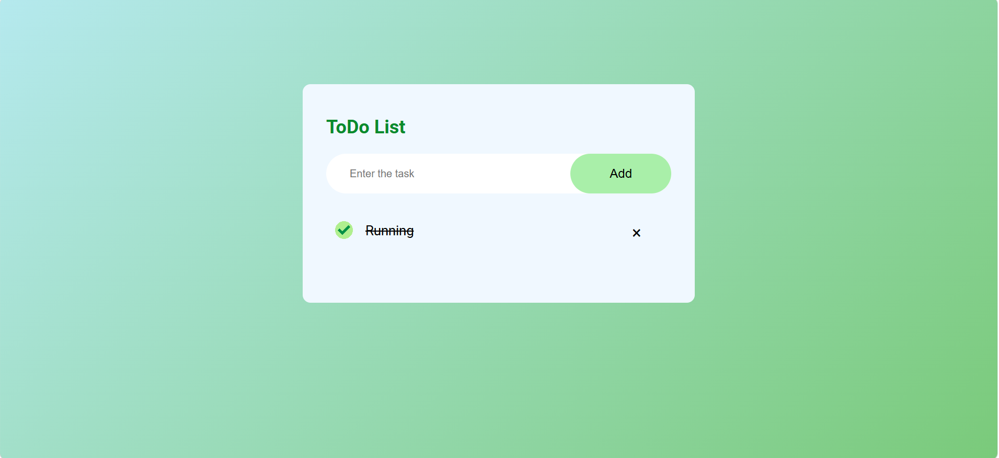

# Interactive To-Do List Application

## Objective

Create a simple to-do list app where users can add new tasks, mark them as complete, and remove them.

## Requirements

- Use DOM manipulation to create, update, and delete list items.
- Attach event listeners for adding tasks and toggling their completion status.
- Optionally store tasks in an array or use `localStorage` for persistence.

### Screenshot Outputs

#### LocalStoreage

- localStorage is used to store data in the browser permanently until manually cleared
- It is stored in the browser itself like Edge

#### 1

#### 2

#### 3

#### 4

#### 5

#### 6

