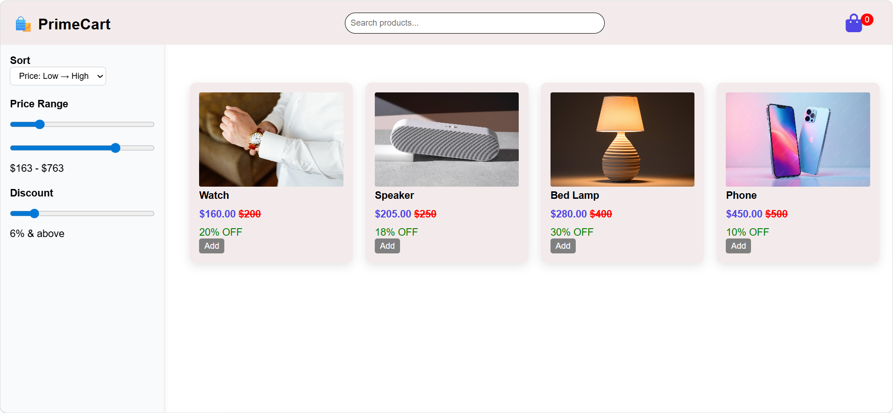
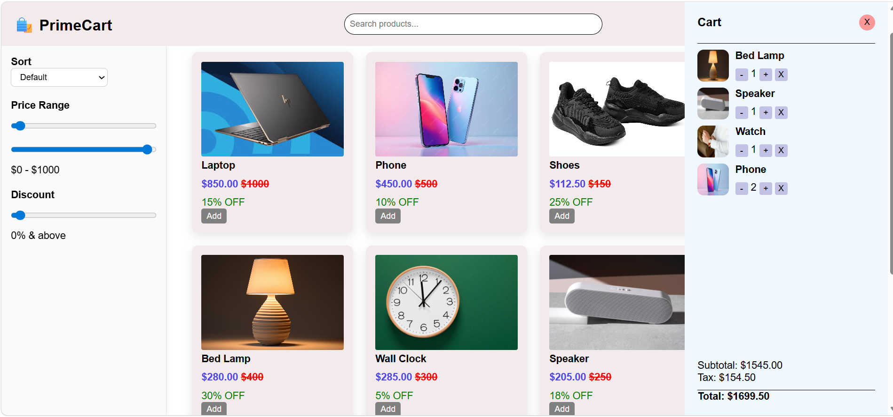
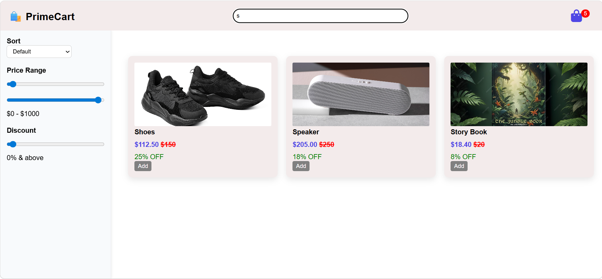
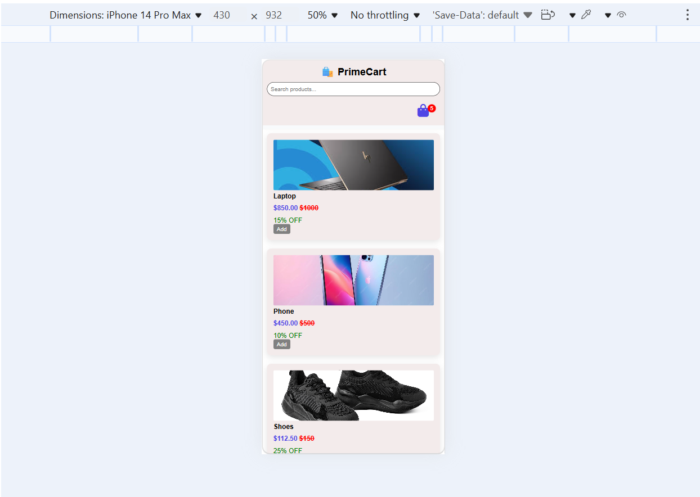
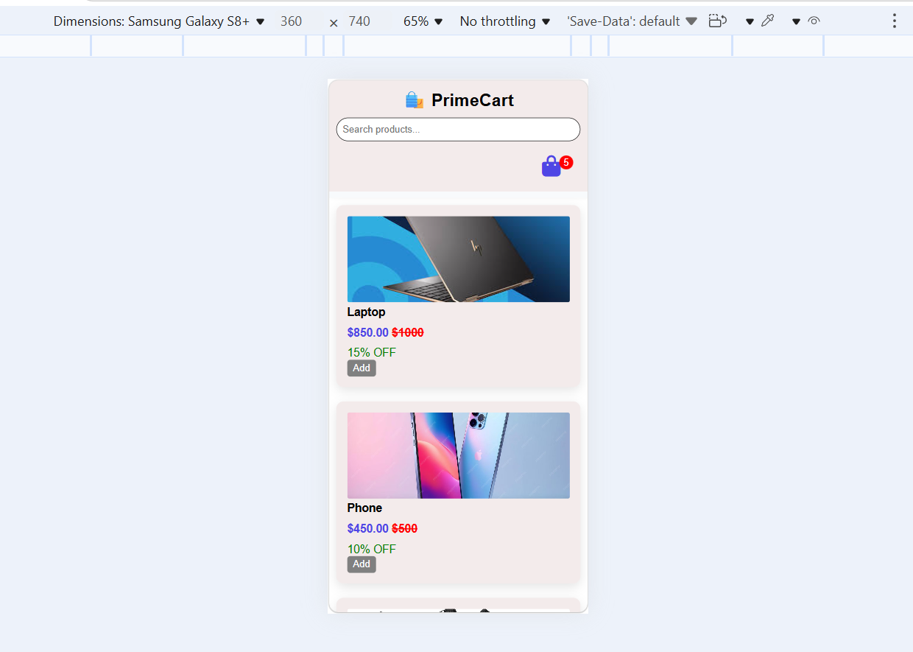
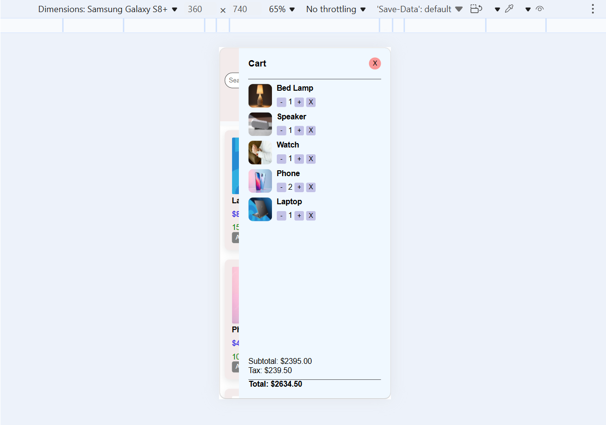

# Full-featured eCommerce Shopping Cart

## Objective

Build a comprehensive eCommerce simulation that includes product listings, a shopping cart, and dynamic price calculations.

## Requirements

- **Product Listing:** Dynamically load and display product information (images, prices, descriptions) from a data source.
- **Shopping Cart:** Implement add-to-cart functionality, allowing users to adjust quantities and remove items.
- **State Management:** Use JavaScript to manage cart state and persist data using `localStorage`.
- **Price Calculations:** Dynamically compute totals, taxes, and discounts based on cart contents.
- **Product Filtering/Search:** Add features for filtering products by category or searching by keywords.
- **Responsive UI:** Ensure the interface adapts well to various screen sizes and devices.
- **Advanced Concepts:** Incorporate modular JavaScript (ES6 modules), advanced error handling, and efficient DOM manipulation techniques.

### Screenshot Outputs

#### 1

#### 2

#### 3

#### 4

#### 5

#### 6

#### 7

#### 8

