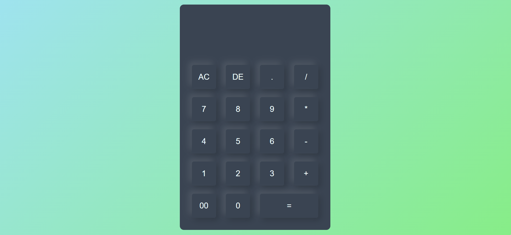
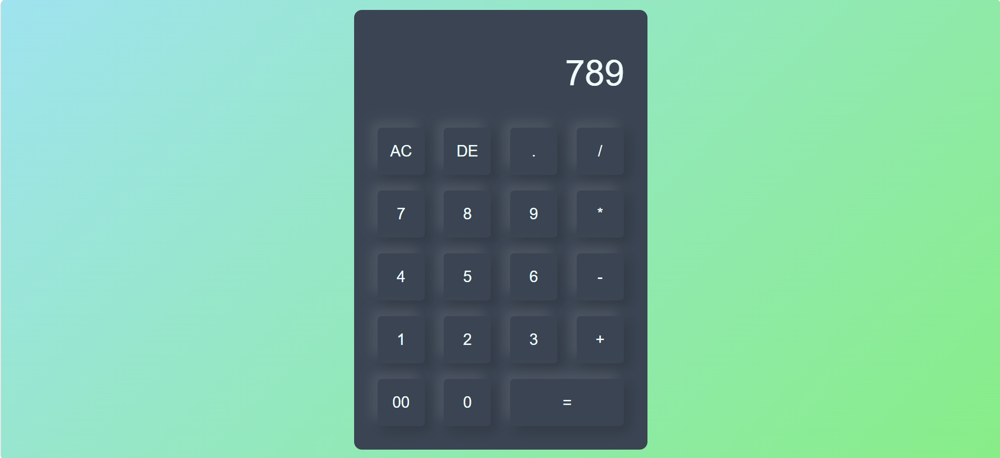
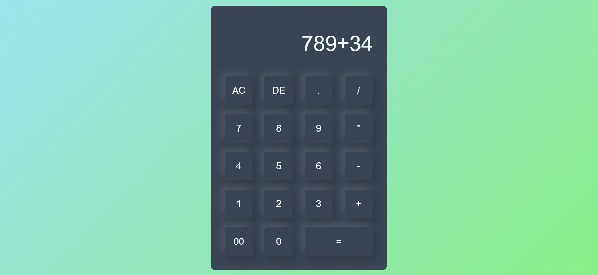
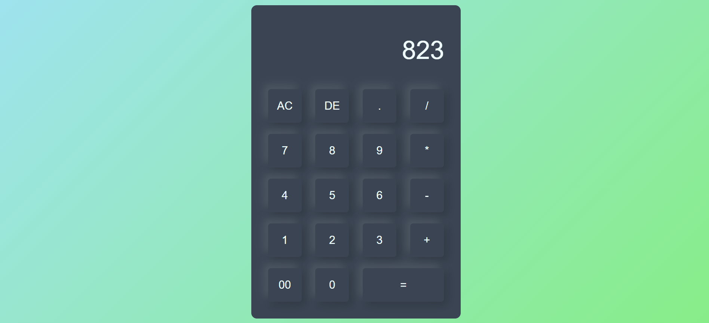

# Simple Calculator

## Objective
Build a basic calculator that performs arithmetic operations like addition, subtraction, multiplication, and division.

## Requirements
- Create number and operator buttons in HTML.
- Use JavaScript to capture user input and perform calculations.
- Update the display dynamically as the user interacts with the calculator.
- Optionally use `localStorage` to persist previous calculations.

### Screenshot Outputs

#### 1

#### 2

#### 3

#### 4

