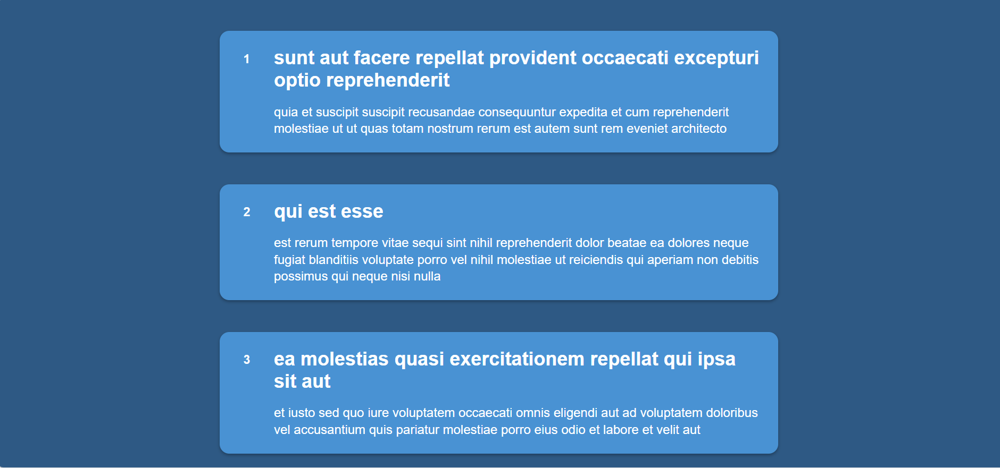
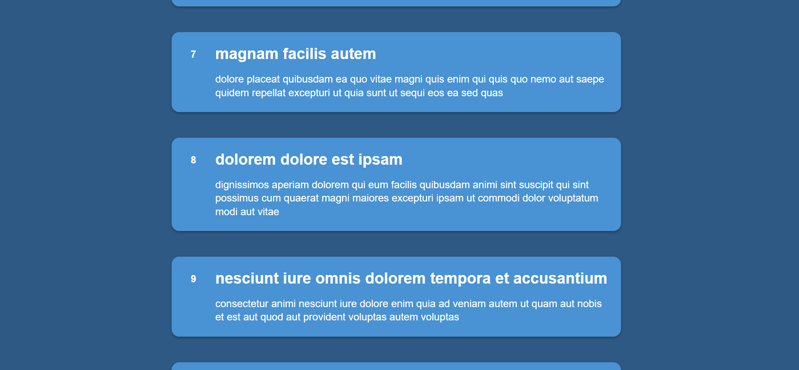
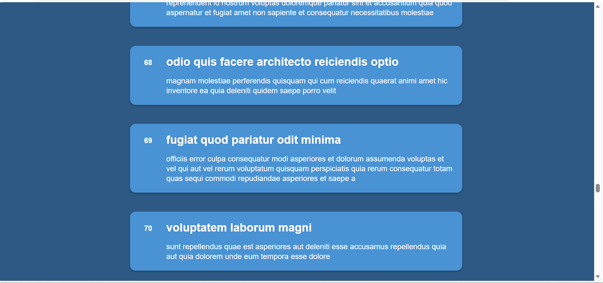

# Infinite Scrolling Content Loader

## Objective
Create a web page that loads additional content as the user scrolls toward the bottom.

## Requirements
- Detect when the user is near the bottom of the page using the scroll event.
- Use the Fetch API to load more data asynchronously (simulate with dummy data or an API).
- Append new content to the page while ensuring smooth performance and user experience.

### Screenshot Outputs

#### 1

#### 2

#### 3

